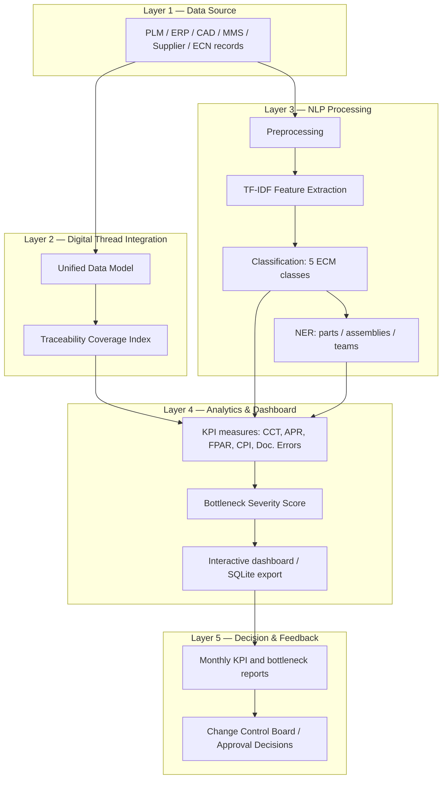

# ECM Digital Thread Toolkit

An open-source implementation of an Engineering Change Management (ECM)
framework for heavy machinery manufacturing that integrates Digital Thread
traceability, NLP-based change-request classification, and KPI and
bottleneck analytics.

Companion implementation for:

> **Accelerating the Digital Thread in Heavy Machinery using Power BI and
> NLP to Mitigate Bottlenecks in the Engineering Change Management (ECM)
> Lifecycle**
> Yeddula, V.R., Shaikh, S.S., Choksi, H.A. — *Proceedings of the 5th
> International Conference on Computer Networks, Big Data and IoT
> (ICCBI-2026)*, pp. 655–663. ISBN 979-8-3315-6379-0.

```
python scripts/run_all.py
```

runs the full pipeline on the synthetic demonstration dataset and writes
tables, figures and an interactive analytics dashboard to `results/`,
together with the paper's published Tables 1–4.

> **Note:** Provided for academic and research experimentation purposes
> only. See [Disclaimer](#disclaimer) below.

## Relationship to the published paper

* This repository is an open-source implementation of the framework
  described in the paper: its five-layer architecture (Figure 1), Equations
  (1)–(3), the NLP classification and named-entity extraction pipeline, and
  the KPI and bottleneck analytics, with unit tests and a runnable pipeline.
* The paper reports a case study of 1,200 engineering change records
  collected from a heavy machinery manufacturing environment over a
  six-month operational period. It publishes the study's summary results
  (Tables 1–4, Figures 2–5) but not the underlying records.
* The pipeline runs on a synthetic demonstration dataset, so its numerical
  outputs illustrate the method and differ from the case-study values in the
  paper.
* The paper's dashboards are built in Power BI and its classifier is a
  fine-tuned BERT model. This toolkit uses open-source equivalents by
  default: KPI measures written as pandas functions, a Chart.js HTML
  dashboard with an SQLite export, and a TF-IDF + linear SVM classifier. The
  paper's BERT fine-tuning procedure is available as an optional backend.
* The paper's own results are provided alongside by
  `scripts/06_published_values.py`: Tables 1–4 as printed, and consistency
  checks on them.

## Verifying against the paper

| In the paper | In this repository | Status |
|---|---|---|
| Figure 1 — five-layer architecture | `src/ecm_digital_thread/`, one module per layer | Implemented; the Layer 5 incremental-learning loop is not simulated |
| Equation (1) — Traceability Coverage Index | `digital_thread.traceability_coverage_index` | Implemented |
| Equation (2) — TF-IDF | `nlp_pipeline.train_classifier` (scikit-learn `TfidfVectorizer`) | Implemented |
| Equation (3) — Bottleneck Severity Score | `kpi_analytics.bottleneck_severity_score` | Implemented; the paper leaves α, β, γ and the flag threshold to organizational calibration, and the toolkit's defaults (0.5 / 0.3 / 0.2, threshold 1.0) are set in `config.py` |
| Five-class change-request classification, NER | `nlp_pipeline` | Implemented; default classifier TF-IDF + linear SVM, the paper's BERT fine-tuning procedure as an optional backend |
| Power BI KPI dashboards | `kpi_analytics`, `dashboard` | Implemented with open-source tools: pandas KPI measures, Chart.js dashboard, SQLite export |
| Table 1 | `results/tables/table1_ecm_performance_before_after_as_reported.*`, `table1_improvement_check_as_reported.*` | Included; each improvement percentage checked against its before/after values |
| Table 2 | `results/tables/table2_nlp_classification_report_as_reported.*`, `table2_f1_check_as_reported.*` | Included; each F1 score checked against its precision and recall, and the overall average against the five class rows |
| Table 3 | `results/tables/table3_qualitative_framework_comparison_as_reported.*` | Included |
| Table 4 | `results/tables/table4_quantitative_benchmarking_as_reported.*` | Included; the "Proposed Framework" row checked against Table 1 |
| Figures 2–5 | — | Not included: apart from the start and end values quoted in the text, their data are given graphically |

Files with the `_as_reported` suffix, and
`results/tables/published_consistency_checks.json`, hold the paper's values
and the checks on them; all other files are generated from the demonstration
dataset.

## Overview

Engineering Change Management in heavy machinery manufacturing involves
cross-functional collaboration, multi-tiered documentation workflows, and
strict compliance requirements — and is routinely slowed by communication
silos, lagging approvals, duplicated documentation, and weak traceability.
This toolkit implements an integrated framework that combines:

* **Digital Thread integration** — a Unified Data Model providing
  bidirectional traceability across design, manufacturing, quality, and
  maintenance data.
* **NLP-based automation** — a classifier that sorts change requests from
  unstructured text (maintenance logs, non-conformance reports, supplier
  communications) into five categories, plus named-entity extraction for
  part numbers, assemblies, responsible teams and subsystems.
* **KPI and bottleneck analytics** — measures of change cycle time,
  approval pipelines and documentation quality, and a composite Bottleneck
  Severity Score that flags congested workflow stages.

## Components

| Component | Description |
|---|---|
| **Dataset** | A synthetic demonstration dataset: 1,200 engineering change records for a fictional heavy-machinery manufacturer over six months (dated January–June 2025), combining structured fields (change order IDs, request dates, workflow stage and cycle time, approval outcomes, part and assembly IDs, lifecycle-linkage flags) and unstructured text (maintenance logs, NCRs, supplier emails, field reports), across five change categories. |
| **Digital Thread layer** | Unified Data Model with cross-lifecycle linkage and Traceability Coverage Index computation. |
| **NLP pipeline** | Text preprocessing, TF-IDF feature extraction, multi-class classification (Safety-Critical / Performance-Related / Regulatory Compliance / Cost-Driven / Customer-Requested), and rule-based NER. An optional BERT fine-tuning backend is included. |
| **KPI & bottleneck analytics** | Change Cycle Time, Approval Pending Rate, First-Pass Approval Rate, Change Propagation Index, Documentation Error Rate, and a configurable Bottleneck Severity Score with automatic stage flagging. |
| **Analytics dashboard** | A self-contained, interactive HTML dashboard (built with Chart.js) — KPI cards, trend lines, and bottleneck visualizations. Also exports to SQLite for use with Metabase, Superset, or Grafana. |
| **Paper results** | The paper's Tables 1–4 as printed, with consistency checks on Tables 1, 2 and 4. |

Every dependency is open source (BSD/MIT/Apache-2.0): `numpy`, `pandas`,
`scikit-learn`, `scipy`, `matplotlib`, `seaborn`, `tabulate`.

## Architecture



See [`docs/methodology.md`](docs/methodology.md) for the equations and
design decisions behind each component.

## Repository layout

```
ecm-digital-thread-toolkit/
├── src/ecm_digital_thread/       # the package
│   ├── config.py                 # paths, constants, demonstration scenario
│   ├── data_generation.py        # synthetic demonstration dataset
│   ├── digital_thread.py         # UDM + Traceability Coverage Index (Eq. 1)
│   ├── nlp_pipeline.py           # preprocessing, TF-IDF (Eq. 2), classifier, NER
│   ├── kpi_analytics.py          # DAX-style KPIs + Bottleneck Severity Score (Eq. 3)
│   ├── dashboard.py              # Chart.js dashboard + SQLite export
│   └── published.py              # the paper's Tables 1-4 + consistency checks
├── scripts/                      # numbered, runnable pipeline steps + run_all.py
├── data/raw/                     # demonstration dataset (CSV)
├── data/processed/               # linked / NLP-scored / KPI intermediate CSVs
├── results/tables/               # demonstration outputs; *_as_reported = the paper's Tables 1-4
├── results/figures/              # demonstration figures (PNG)
├── results/dashboard/            # index.html (open in a browser) + ecm_analytics.db (SQLite)
├── tests/                        # unit tests for every module
├── docs/methodology.md           # equations and design decisions
├── pyproject.toml                # packaging metadata (pip install -e .)
├── pytest.ini                    # test discovery config
└── .github/workflows/ci.yml      # CI: tests + full pipeline on every push
```

## Quick start

Requires Python 3.10 or newer.

```bash
git clone https://github.com/yeddula-research/ecm-digital-thread-toolkit.git
cd ecm-digital-thread-toolkit
python -m venv .venv && source .venv/bin/activate      # optional but recommended
pip install -r requirements.txt

python scripts/run_all.py
```

Then open `results/dashboard/index.html` in a browser.

### Run individual stages

```bash
python scripts/01_generate_dataset.py            # -> data/raw/ecm_demonstration_dataset.csv
python scripts/02_run_digital_thread.py          # -> data/processed/ecm_records_linked.csv, TCI
python scripts/03_train_nlp_classifier.py        # -> classification report, NER accuracy
python scripts/04_compute_kpis_bottlenecks.py    # -> monthly KPIs, Bottleneck Severity Score
python scripts/05_generate_figures_tables.py     # -> demonstration tables, figures, dashboard
python scripts/06_published_values.py            # -> the paper's Tables 1-4, consistency checks
```

### Run the tests

```bash
pip install -r requirements-dev.txt
pytest -v
```

### Optional: BERT backend

The default classifier (TF-IDF + linear SVM) needs no extra installs and
trains in seconds. The paper's fine-tuned BERT classifier is also available
(70:15:15 split, AdamW, lr=2e-5, batch size 16, 5 epochs, max sequence
length 256):

```bash
pip install torch transformers
python scripts/03_train_nlp_classifier.py --backend transformer
```

This requires internet access to download pretrained BERT weights; a GPU is
recommended for practical training times.

## Results

Running `python scripts/run_all.py` regenerates every table below from the
bundled demonstration dataset and writes them to `results/tables/`.

**Demonstration KPIs, month 1 vs month 6**
(this run's demonstration-dataset output; `table1_ecm_performance_before_after.*`)

| Metric | Month 1 | Month 6 | Change |
|---|---|---|---|
| Change Cycle Time (days) | 19.77 | 14.41 | 27.1% ↓ |
| Approval Pending Rate (%) | 34.0 | 21.5 | 36.8% ↓ |
| First-Pass Approval Rate (%) | 66.0 | 69.0 | 4.5% ↑ |
| Traceability Coverage Index (%) | 51.0 | 81.5 | 59.8% ↑ |
| Documentation Error Rate (%) | 13.5 | 12.0 | 11.1% ↓ |
| Change Propagation Index (%) | 72.75 | 89.50 | 23.0% ↑ |

Over all six months, the Traceability Coverage Index (Eq. 1) is 67.75%. The
Bottleneck Severity Score (Eq. 3) flags one stage: Design Review in month 1
(BSS 1.02 against the 1.0 threshold).

**Demonstration NLP classification report**
(this run's demonstration-dataset output, held-out test set; `table2_nlp_classification_report.*`)

| Category | Precision | Recall | F1-Score |
|---|---|---|---|
| Cost-Driven | 0.97 | 0.87 | 0.92 |
| Customer-Requested | 0.91 | 0.94 | 0.93 |
| Performance-Related | 0.90 | 0.97 | 0.94 |
| Regulatory Compliance | 0.86 | 0.91 | 0.89 |
| Safety-Critical | 0.91 | 0.86 | 0.89 |
| **Overall Average (macro)** | **0.91** | **0.91** | **0.91** |

The rule-based NER recovers every part number, assembly ID, team and
subsystem in the demonstration text (`ner_extraction_accuracy.json`); because
that text is built from templates, free text from a real ECM system would
score lower.

The tables above are generated fresh from the seeded demonstration dataset
each time the pipeline runs. Each month holds about 200 records, so the
monthly values scatter around the scenario settings listed under
[Dataset](#dataset). Because they come from the demonstration dataset, they
differ from the case-study values in the paper's Tables 1 and 2.

**The paper's Table 1 — ECM Performance Metrics Before and After Implementation**
(from the paper; `table1_ecm_performance_before_after_as_reported.*`)

| Metric | Before Implementation | After Implementation | Improvement |
|---|---|---|---|
| Change Cycle Time (days) | 18.5 | 10.2 | 44.9% ↓ |
| Approval Pending Rate (%) | 32 | 14 | 56.2% ↓ |
| First-Pass Approval Rate (%) | 58 | 81 | 39.6% ↑ |
| Traceability Coverage Index (%) | 61 | 92 | 50.8% ↑ |
| Documentation Errors (%) | 21 | 8 | 61.9% ↓ |

`scripts/06_published_values.py` writes the paper's Tables 1–4 on every run
and checks them against themselves:

* Table 1: each improvement percentage, recomputed from its before/after
  values, agrees with the printed value to within 0.06 percentage points.
* Table 2: each F1 score equals the harmonic mean of its precision and
  recall at two decimals, and the "Overall Average" row equals the mean of
  the five class rows after rounding (0.888, 0.868 and 0.878 against 0.89,
  0.87 and 0.88).
* Table 4: the "Proposed Framework" row matches the corresponding Table 1
  values.

Tables 3 and 4 compare the framework with other ECM approaches that this
repository does not implement, so they are taken from the paper.

Figures written to `results/figures/` on every run, from the demonstration
dataset:

* `figure2_change_cycle_time_reduction.png` — mean change cycle time by month
* `figure3_bottleneck_distribution.png` — Bottleneck Severity Score by workflow stage, month 1 and month 6
* `figure4_first_pass_approval_trend.png` — first-pass approval rate by month
* `figure5_traceability_coverage_improvement.png` — Traceability Coverage Index by month

The interactive dashboard is at `results/dashboard/index.html`, and the same
data are exported to `results/dashboard/ecm_analytics.db`.

## Dataset

The demonstration dataset is synthetic: 1,200 engineering change records for a fictional heavy-machinery manufacturer, generated with a fixed random seed by scripts/01_generate_dataset.py from the illustrative scenario in config.DEMO_SCENARIO; it is not the paper's case-study data, and its before/after trend is an input of the scenario rather than a measured effect.

The paper's case study used 1,200 ECM records collected over a six-month
operational period from PLM, ERP, maintenance management, supplier
communication and ECN systems in a heavy machinery manufacturing
environment. The paper reports summary results but not the records
themselves. The demonstration dataset mirrors the case study's structure
(1,200 records over six months, the same five change categories, and the
same kinds of unstructured text) so that anyone can
run the complete pipeline end-to-end; its values and trend are the
toolkit's own.

`config.DEMO_SCENARIO` sets the month-1 and month-6 operating points, and the
generator interpolates linearly between them:

| Metric | Month 1 | Month 6 |
|---|---|---|
| Change Cycle Time (days) | 20.0 | 14.0 |
| Approval Pending Rate (%) | 30 | 20 |
| First-Pass Approval Rate (%) | 60 | 72 |
| Traceability Coverage Index (%) | 55 | 80 |
| Documentation Errors (%) | 15 | 10 |

The remaining settings (class shares, stage congestion, text overlap between
classes) are listed in [`docs/methodology.md`](docs/methodology.md). Calendar
dates start in January 2025 (`config.DATASET_START_YEAR` /
`config.DATASET_START_MONTH`).

To use your own ECM data instead, replace
`data/raw/ecm_demonstration_dataset.csv` with an export in the same schema
and re-run from `scripts/02_run_digital_thread.py` onward.

## Extending this toolkit

* **Plug in your own data**: replace `data/raw/ecm_demonstration_dataset.csv`
  with an ECM export in the same schema (see the column list in
  `tests/test_data_generation.py`) and re-run from
  `scripts/02_run_digital_thread.py` onward.
* **Different BSS weighting**: `config.BSS_ALPHA/BETA/GAMMA` and
  `BSS_FLAG_THRESHOLD` are the only place these live — change them and
  re-run `scripts/04_compute_kpis_bottlenecks.py`.
* **A different classifier**: `nlp_pipeline.train_classifier(..., classifier="logreg")`
  swaps in Logistic Regression; the transformer backend is a third option.
* **A hosted BI dashboard**: point Metabase/Superset/Grafana at
  `results/dashboard/ecm_analytics.db` instead of (or alongside) the static
  HTML dashboard.

## License

MIT — see [`LICENSE`](LICENSE). Free to use, modify, and redistribute,
including commercially, with attribution.

## Disclaimer

This repository — the code, dataset, results, and dashboard — is provided
for **academic and research experimentation purposes only**. It has not
been tested, validated, or certified for use in any production,
safety-critical, regulatory-compliance, or commercial ECM deployment. Use
it at your own risk.

The authors and copyright holders make no warranties about this software's
completeness, reliability, or accuracy, and accept no liability for any
damages — direct, indirect, incidental, or consequential — arising from its
use. See [`LICENSE`](LICENSE) for the full disclaimer.

## Citation

See [`CITATION.cff`](CITATION.cff).

```bibtex
@inproceedings{yeddula2026digitalthread,
  title     = {Accelerating the Digital Thread in Heavy Machinery using Power BI and NLP to Mitigate Bottlenecks in the Engineering Change Management (ECM) Lifecycle},
  author    = {Yeddula, Vijayakumar Reddy and Shaikh, Shahnawaz Shakil and Choksi, Harshal Amit},
  booktitle = {Proceedings of the 5th International Conference on Computer Networks, Big Data and IoT (ICCBI-2026)},
  pages     = {655--663},
  year      = {2026},
  isbn      = {979-8-3315-6379-0}
}
```

## Contributing

Issues and pull requests are welcome — real-world ECM datasets, additional
NER backends, and BSS calibrations from other organizations' operational
data are all valuable contributions.
