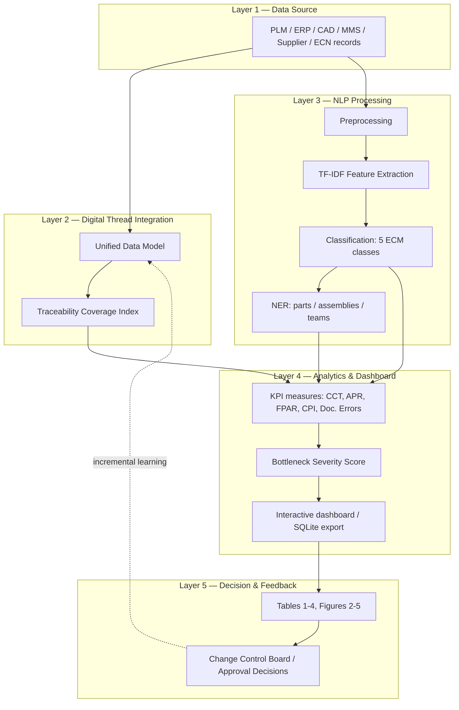

# ECM Digital Thread Toolkit

An intelligent, open-source framework for Engineering Change Management
(ECM) in heavy machinery manufacturing — integrating Digital Thread
traceability, NLP-based automated change-request classification, and
real-time KPI and bottleneck analytics.

Companion implementation for:

> **Accelerating the Digital Thread in Heavy Machinery using Power BI and
> NLP to Mitigate Bottlenecks in the Engineering Change Management (ECM)
> Lifecycle**
> Yeddula, V.R., Shaikh, S.S., Choksi, H.A. — *Proceedings of the 5th
> International Conference on Computer Networks, Big Data and IoT
> (ICCBI-2026)*, pp. 655–663. ISBN 979-8-3315-6379-0.

```
python scripts/run_all.py
```

> **Note:** Provided for academic and research experimentation purposes
> only. See [Disclaimer](#disclaimer) below.

runs the full pipeline and writes Tables 1–4, Figures 2–5, and an
interactive analytics dashboard to `results/`.

## Overview

Engineering Change Management in heavy machinery manufacturing involves
cross-functional collaboration, multi-tiered documentation workflows, and
strict compliance requirements — and is routinely slowed by communication
silos, lagging approvals, duplicated documentation, and weak traceability.
This toolkit implements an integrated framework that combines:

* **Digital Thread integration** — a Unified Data Model providing
  bidirectional traceability across design, manufacturing, quality, and
  maintenance data.
* **NLP-based automation** — a fine-tunable classifier that extracts,
  classifies, and prioritizes change requests from unstructured text
  (maintenance logs, non-conformance reports, supplier communications),
  plus named-entity extraction for part numbers, assemblies, and
  responsible teams.
* **Real-time analytics** — KPI dashboards tracking change cycle time,
  approval pipelines, and a composite Bottleneck Severity Score that
  automatically flags congested workflow stages.

## Components

| Component | Description |
|---|---|
| **Dataset** | 1,200 ECM records spanning a 6-month operational period (Jan–Jun 2025), combining structured fields (change orders, dated requests, approvals, BOM, workflow status) and unstructured text (maintenance logs, NCRs, supplier emails, field reports), across 5 change categories. |
| **Digital Thread layer** | Unified Data Model with cross-lifecycle linkage and Traceability Coverage Index computation. |
| **NLP pipeline** | Text preprocessing, TF-IDF feature extraction, multi-class classification (Safety-Critical / Performance-Related / Regulatory Compliance / Cost-Driven / Customer-Requested), and rule-based NER. An optional BERT fine-tuning backend is included for higher-capacity deployments. |
| **KPI & bottleneck analytics** | Change Cycle Time, Approval Pending Rate, First-Pass Approval Rate, Change Propagation Index, Documentation Error Rate, and a configurable Bottleneck Severity Score with automatic stage flagging. |
| **Analytics dashboard** | A self-contained, interactive HTML dashboard (built with Chart.js) — KPI cards, trend lines, and bottleneck visualizations. Also exports to SQLite for use with Metabase, Superset, or Grafana. |

Every dependency is open source (BSD/MIT/Apache-2.0): `numpy`, `pandas`,
`scikit-learn`, `scipy`, `matplotlib`, `seaborn`.

## Architecture



See [`docs/methodology.md`](docs/methodology.md) for the equations and
design decisions behind each component.

## Repository layout

```
ecm-digital-thread-toolkit/
├── src/ecm_digital_thread/       # the package
│   ├── config.py                 # paths, constants, KPI operating points
│   ├── data_generation.py        # ECM dataset generator
│   ├── digital_thread.py         # UDM + Traceability Coverage Index (Eq. 1)
│   ├── nlp_pipeline.py           # preprocessing, TF-IDF, classifier, NER
│   ├── kpi_analytics.py          # DAX-style KPIs + Bottleneck Severity Score (Eq. 3)
│   └── dashboard.py              # Chart.js dashboard + SQLite export
├── scripts/                      # numbered, runnable pipeline steps + run_all.py
├── data/raw/                     # ECM dataset (CSV)
├── data/processed/               # linked / NLP-scored / KPI intermediate CSVs
├── results/tables/               # Tables 1-4 as CSV + Markdown + JSON
├── results/figures/              # Figures 2-5 as PNG
├── results/dashboard/            # index.html (open in a browser) + ecm_analytics.db (SQLite)
├── tests/                        # unit tests for every module
├── docs/methodology.md           # equations and design decisions
├── pyproject.toml                # packaging metadata (pip install -e .)
├── pytest.ini                    # test discovery config
└── .github/workflows/ci.yml      # CI: tests + full pipeline on every push
```

## Quick start

```bash
git clone <this-repo-url>
cd ecm-digital-thread-toolkit
python -m venv .venv && source .venv/bin/activate      # optional but recommended
pip install -r requirements.txt

python scripts/run_all.py
```

Then open `results/dashboard/index.html` in a browser.

### Run individual stages

```bash
python scripts/01_generate_dataset.py            # -> data/raw/ecm_demonstration_dataset.csv
python scripts/02_run_digital_thread.py          # -> data/processed/ecm_records_linked.csv, TCI
python scripts/03_train_nlp_classifier.py        # -> classification report, NER accuracy
python scripts/04_compute_kpis_bottlenecks.py    # -> monthly KPIs, Bottleneck Severity Score
python scripts/05_generate_figures_tables.py     # -> Tables 1-4, Figures 2-5, dashboard
```

### Run the tests

```bash
pip install -r requirements-dev.txt
pytest -v
```

### Optional: BERT backend

The default classifier (TF-IDF + linear SVM) needs no extra installs and
trains in seconds. For higher-capacity deployments, a fine-tuned BERT
classifier is also available (70:15:15 split, AdamW, lr=2e-5, batch size
16, 5 epochs, max sequence length 256):

```bash
pip install torch transformers
python scripts/03_train_nlp_classifier.py --backend transformer
```

This requires internet access to download pretrained BERT weights; a GPU is
recommended for practical training times.

## Results

Running `python scripts/run_all.py` regenerates every table below from the
bundled demonstration dataset and writes them to `results/tables/`.

**Table 1 — ECM Performance Metrics Before and After Implementation**
(this run's demonstration-dataset output)

| Metric | Before Implementation | After Implementation | Improvement |
|---|---|---|---|
| Change Cycle Time (days) | 18.82 | 9.90 | 47.4% ↓ |
| Approval Pending Rate (%) | 27.5 | 13.0 | 52.7% ↓ |
| First-Pass Approval Rate (%) | 63.5 | 81.0 | 27.6% ↑ |
| Traceability Coverage Index (%) | 63.5 | 91.5 | 44.1% ↑ |
| Documentation Error Rate (%) | 19.0 | 10.5 | 44.7% ↓ |
| Change Propagation Index (%) | 81.12 | 95.38 | 17.6% ↑ |

**Table 2 — NLP Model Performance for Change Request Classification**
(this run's demonstration-dataset output)

| Category | Precision | Recall | F1-Score |
|---|---|---|---|
| Cost-Driven | 0.90 | 0.92 | 0.91 |
| Customer-Requested | 0.91 | 0.82 | 0.86 |
| Performance-Related | 0.88 | 0.95 | 0.91 |
| Regulatory Compliance | 0.92 | 0.92 | 0.92 |
| Safety-Critical | 0.93 | 0.93 | 0.93 |
| **Overall Average** | **0.91** | **0.91** | **0.91** |

Tables 1 and 2 above are generated fresh from the seeded demonstration
dataset each time the pipeline runs, so they will naturally differ in the
last digit or two from one environment to the next and from the paper's
own originally reported Table 1 / Table 2 (see [Dataset](#dataset) below).
This is expected and by design: the demonstration dataset is a separate,
disclosed stand-in for data that was never published, not a copy of it.

**Table 4 — Quantitative Benchmarking Against Existing ECM Frameworks**
(as reported in the paper)

| Framework | Change Cycle Time Reduction | First-Pass Approval Rate | Traceability Coverage | Documentation Error Reduction |
|---|---|---|---|---|
| Traditional ECM Systems | 12.4% | 52% | 48% | 18% |
| Process Mining-Based ECM | 26.8% | 64% | 67% | 34% |
| AI-Assisted Predictive ECM | 35.2% | 73% | 79% | 46% |
| **Proposed Framework** | **44.9%** | **81%** | **92%** | **61.9%** |

Table 4 compares against three other published frameworks that this repo
does not implement, so its figures are quoted directly from the paper
rather than computed by this run; `scripts/05_generate_figures_tables.py`
writes it out unchanged on every run for convenience.

Figures 2–5 (cycle time reduction, bottleneck distribution, first-pass
approval trend, and traceability coverage improvement) are written to
`results/figures/` on every run, and the full interactive dashboard is at
`results/dashboard/index.html`.

## Dataset

`data/raw/ecm_demonstration_dataset.csv` is a demonstration dataset,
generated by `scripts/01_generate_dataset.py`, covering 1,200 engineering
change requests dated across a 6-month operational window (January–June
2025, set by `config.DATASET_START_YEAR` / `config.DATASET_START_MONTH`),
with the schema and class taxonomy described in `docs/methodology.md`. It
lets anyone run the complete pipeline end-to-end without needing access to
a live enterprise environment — the study data underlying the paper was not
published, consistent with standard data-confidentiality practice in
applied research. To use your own ECM data instead, replace the CSV with your own
export in the same schema and re-run from `scripts/02_run_digital_thread.py`
onward.

## Extending this toolkit

* **Plug in your own data**: replace `data/raw/ecm_demonstration_dataset.csv`
  with an ECM export in the same schema (see the column list in
  `tests/test_data_generation.py`) and re-run from
  `scripts/02_run_digital_thread.py` onward.
* **Different BSS weighting**: `config.BSS_ALPHA/BETA/GAMMA` and
  `BSS_FLAG_THRESHOLD` are the only place these live — change them and
  re-run `scripts/04_compute_kpis_bottlenecks.py`.
* **A different classifier**: `nlp_pipeline.train_classifier(..., classifier="logreg")`
  swaps in Logistic Regression; the transformer backend is a third option.
* **A hosted BI dashboard**: point Metabase/Superset/Grafana at
  `results/dashboard/ecm_analytics.db` instead of (or alongside) the static
  HTML dashboard.

## License

MIT — see [`LICENSE`](LICENSE). Free to use, modify, and redistribute,
including commercially, with attribution.

## Disclaimer

This repository — the code, dataset, results, and dashboard — is provided
for **academic and research experimentation purposes only**. It has not
been tested, validated, or certified for use in any production,
safety-critical, regulatory-compliance, or commercial ECM deployment. Use
it at your own risk.

The authors and copyright holders make no warranties about this software's
completeness, reliability, or accuracy, and accept no liability for any
damages — direct, indirect, incidental, or consequential — arising from its
use. See [`LICENSE`](LICENSE) for the full disclaimer.

## Citation

See [`CITATION.cff`](CITATION.cff).

```bibtex
@inproceedings{yeddula2026digitalthread,
  title     = {Accelerating the Digital Thread in Heavy Machinery using Power BI and NLP to Mitigate Bottlenecks in the Engineering Change Management (ECM) Lifecycle},
  author    = {Yeddula, Vijayakumar Reddy and Shaikh, Shahnawaz Shakil and Choksi, Harshal Amit},
  booktitle = {Proceedings of the 5th International Conference on Computer Networks, Big Data and IoT (ICCBI-2026)},
  pages     = {655--663},
  year      = {2026},
  isbn      = {979-8-3315-6379-0}
}
```

## Contributing

Issues and pull requests are welcome — real-world ECM datasets, additional
NER backends, and BSS calibrations from other organizations' operational
data are all valuable contributions.
